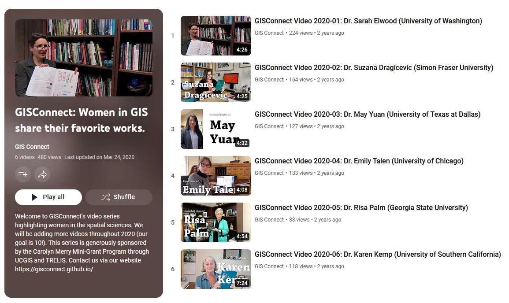
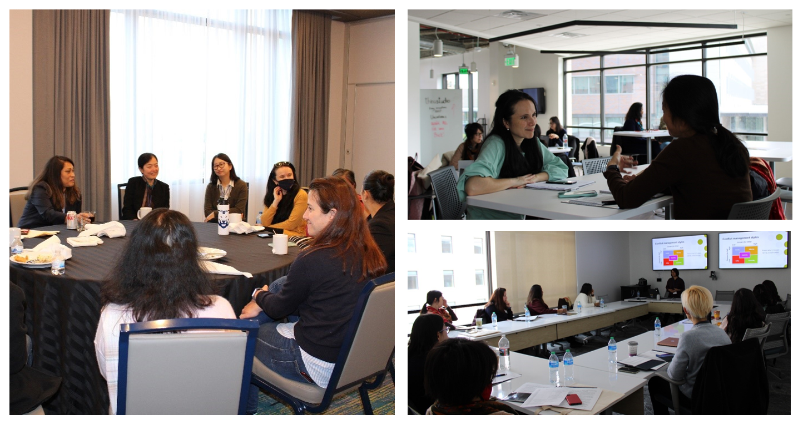
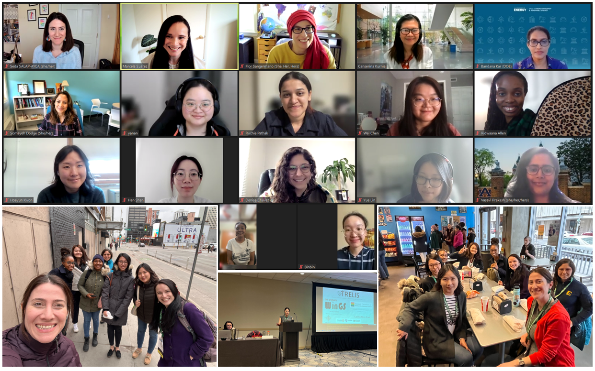

## Growing the TRELIS family
Funded by Carolyn Merry mini-grants, TRELIS fellows have built-upon and expanded the TRELIS mission. The mini-grant program is named after [Dr. Carolyn Merry](https://landsat.gsfc.nasa.gov/article/remembering-carolyn-merry/) in honor of her mentoring of women and junior scholars. Dr. Merry was a professor emerita of Civil, Environmental and Geodetic Engineering at The Ohio State University and former President of UCGIS.

### GIS Connect
 [GIS Connect](https://gisconnect.github.io/) is a video series used to highlight and recognize the contributions of female thought leaders and role models in GIScience. The goal was to connect younger generations with established researchers to help encourage their studies and interest in GIS. Prominent women in the field of GIScience were invited to participate. The following women created videos for the series: Dr. Sarah Elwood, Dr. Suzana Dragicevic, Dr. May Yuan, Dr. Emily Talen, Dr. Risa Palm, and Dr. Karen Kemp. 
 
 

The project was presented at a virtual event at AAG 2020, where each of the [six videos](https://www.youtube.com/playlist?list=PL2xUaCb8VRCAcTnrCrH67C1lnMxVq7gbr) were played, along with time for discussion. Two speakers were present and other attendees could ask direct questions about their career paths. The event was attended by 30 people. This project was led by Drs. Clio Andris, Marynia Kolak, and Stephanie Rogers.

### Golden Compass
The [Golden Compass workshop](https://goldencompassworkshop.github.io) was an in-person networking opportunity that aimed to create a safe space for training and sharing experiences among foreign national women geospatial scientists and promote success in their career, leadership, and life in the US. 

The participants formed a special group of scholars who are women of color, non-native English speakers (with English as their second language), and may lack the social, economic, and cultural capital needed to fully take advantage of their talent and maximize their career impacts. As qualified academic professionals, these women have rich subject matter expertise. The challenges they face in the workplace are related to their gender, cultural background, and social status in the U.S. Participants shared their unique experiences and challenges, as well as strategies for their success during a one-and-half day workshop in Denver, Colorado. This project was led by Drs. Jieun Lee, Huyen Le, Monica Haddad, and Laxmi Ramasubramanian.

### Grad WINGS (Women+ in Geospatial Science)
[Grad WINGS](https://sites.google.com/umass.edu/gradwings/home) (Women+ in Geospatial Science) was a workshop for first-generation, BIPOC or foreign-born woman (1) pursuing a PhD ; (2) in a graduate program considering a Ph.D. or (3) a recent graduate from a PhD program in geospatial sciences (GIScience, remote sensing, spatial analysis, and mapping sciences). 

A total of 11 women took part in the workshop virtually (January & April 2023) and in-person at the AAG in Denver, CO 2023. The participants were at different points in their graduate studies and a mixture of first-generation students, BIPOC participants, and those born outside the United States; and sometimes a combination of all these. Together they formed a support network expanding the original TRELIS mission. This project was lead by Drs. Seda Şalap-Ayça, Marcela Suarez, and Florencia Sangermano.

[back](./)
